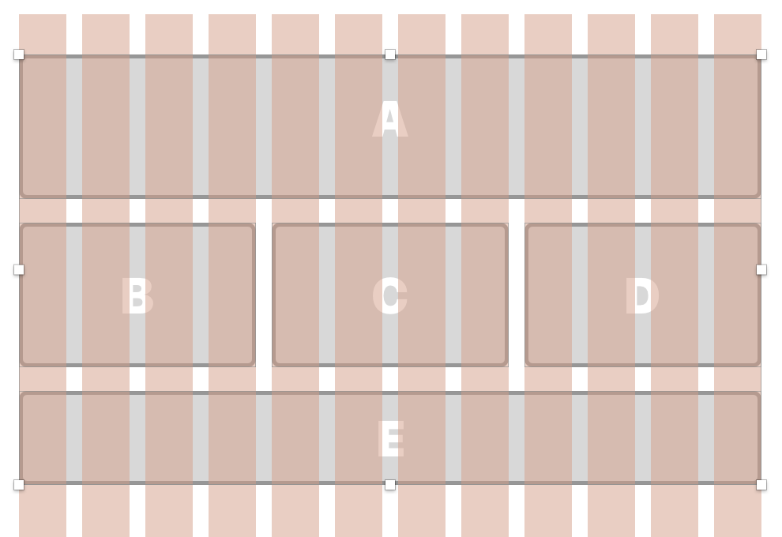

# Front-end-Web-Class-9

## Objectives

- Analyze pages for responsive design
- Apply media queries 

## Schedule 

|    | time   |    |      | Description                                |
|----|--------|----|------|--------------------------------------------|
|  1 |  5 min |  5 | TT   | Design a repsonsive                        |
|  2 |  5 min | 10 | TT   | Designing for multiple screen sizes Sketch |
|  3 |  5 min | 15 | Work | Sketch Challenge                           |
|  4 |  5 min | 20 | TT   | When should a layout change?               |
|  5 |  5 min | 20 | TT   | Bootstrap Break Points                     |
|  6 |  5 min | 25 | TT   | Testing                                    |
|  7 | 30 min | 50 | Work | Challenges                                 |

### 1 - Design a repsonsive

Responsive sites adjust to the device they are displayed on. 
You will need to adjust the layout based on the available screen realestate.

Desktop Layout


Mobile Layout


[Sketch Example](Notes/Responsive-Desktop.sketch)

[Responsive Design](https://www.fastcodesign.com/3038367/9-gifs-that-explain-responsive-design-brilliantly)

#### What is "media" 

Media can be just about anything. CSS defines the following media types: 

- all
- print
- screen
- speech

#### Media Features

That's not all, media can be qualified by checking the features of the current media. 
CSS looks at the following features, see the list here: 

[https://developer.mozilla.org/en-US/docs/Web/CSS/@media](https://developer.mozilla.org/en-US/docs/Web/CSS/@media)

These modifiers can be applied: and, only, max, min. 

You can put these together to create CSS rules that apply in a wide variety of situations. 
Generally the most common use is creating rules that apply to mobile vs desktop. 
These are usually written to target different screen sizes. 

### 2 - Designing for multiple screen sizes Sketch

As the screen narrows things need to change size. The layout of the page needs to 
change when the screen gets smaller. 

#### Sketch Artboards and Pages and Layout

Artboards in Sketch...

Pages in Sketch...

#### Mobile First vs Desktop First

You might start by designing for mobile or designing for desktop. After desiging for one of these you
will want to add styles that adjust the site to work on the other.

#### Try it with Sketch 

Sketch organizes work into Artboards and Pages. This example uses Pages to organize
two different designs. 

- [Challenge 1 - HTML](Challenges/Challenge-1.sketch)
- [Challenge 2 - HTML](Challenges/Challenge-2.sketch)

### 3 - Sketch Challenge

...

### 4 - When should a layout change?

Start designing your project as either mobile or desktop first. 
After your site looks good on mobile or desktop add styles that fix the layout 
for the other. 

For example imagine you've designed your site for desktop, 
finish this first __before__ adding styles for mobile. When you do add styles 
for mobile your style sheet will only apply these styles when the screen is 
sized for mobile, and these styles will add new styles and override the other 
styles you have as needed. 

#### @media

The `@media` rule allows you to define a block of style rules that apply only 
when your site is viewed on a certain media type/device with features that 
you define. 

Here is an example: 

```
@media screen {
    body {
        background-color: red;
    }
}
```

The block above says the background color of the body tag will be red when this page
is viewed on a screen. In print or other media the background is not red. 

```
@media print {
    body {
        background-color: white;
    }
}
```

The code block above sets the background to white when the media is print. 

### 5 - Bootstrap Break Points

You can also define features that describe the media type in more detail. 
It's common t use the size of the screen to determine when styles will applied
to modify the layout of page to make it compatible with mobile or desktop. 

The screen sizes you look for are called break points. 

#### Break points 

The term "break point" describes the width we can assume fits the screen 
size of a range of devices. 
For example, if a device has a maximum width of 320px then it must be one of the 
early iPhones or a very smaller computer.
If the minimum width is 768px it's at least an iPad in portrait, though it could be 
a larger screen. 

#### Bootstrap CSS

- [Desktop First](media-queries-desktop-first.css)
- [Mobile First](media-queries-mobile-first.css)

### 6 - Testing your responsive sites

- Testing in Safari
    - Using the Simulator
    - Inspecting the Simulator
- Tesing in Chrome
- Firefox probably works the same...

### Responsive stratgeies 

In general terms you will want to design for one platform mobile or desktop. 
Then use media queries to target rules for the other platform. 

For example, imagine you have designed your web site for the desktop. 
You have a box that is 33% width. On mobile this would be too narrow, 
you decide that on molbile boxes should be 100%. 
In CSS this might look this:

```
.box {
    width: 33%;
}

@media screen and (max-width: 414px) { 
    .box {
        width: 100%;
    }
}
```

The first rule sets the width of .box to 33%. 
The @media block contains a block of CSS that defines the width of .box to 100%.
Notice that following @media we have said that the media type is screen and
features a maximum width of 414px. 

The rules defined inside @media are only applied when the conditions are met.

#### Points vs Pixels 

Cell phones screens are made up of pixels the software that runs the display 
calculate screen coordinates in points. Points are abstract units that relate 
screens of different pixel densities. 

For example, the iPhone 6 is 375 points wide, the screen is 750 pixels wide. 
You should always think in point sizes.

For more info on points and pixels see this guide:

- https://www.paintcodeapp.com/news/ultimate-guide-to-iphone-resolutions

### Common break points

If you are starting out you can use the Boostrap CSS media queries as a starting point. 

[bootstrap-media-queries.css](bootstrap-media-queries.css)

This contains two sets of media queries one set marked "Mobile First". 
The other marked "Desktop First". Mobile first assumes that all of the styles 
__outside__ of the media queries style the mobile version, while all of the 
styles in the media queries define style changes that make your site work 
on other screen sizes, like desktop, or tablets. The desktop first rules 
assume you styled the desktop first and will use the media queries to adjust 
styles for mobile devices. 

#### Viewport and Initial Scale

Mobile devices assume a page is not responsive and render it at 960px wide. 
That is the browser renders the page at 960px wide then scales it to fit the 
screen. 

Responisve sites want to be drawn at the width of the device 100% scale. 
You can tell the broswer to do this by adding the following to the head 
of your HTML document. 

`<meta name="viewport" content="width=device-width, initial-scale=1.0" />`

### In class challenges

- [Challenge 4 - HTML](http://www.webdevils.com/make-school/front-end-web-class-9/challenges/Challenge-4.html)
- [Challenge 5 - HTML](http://www.webdevils.com/make-school/front-end-web-class-9/challenges/Challenge-5.html)
- [Challenge 6 - HTML](http://www.webdevils.com/make-school/front-end-web-class-9/challenges/Challenge-6.html)
- [Challenge 7 - HTML](http://www.webdevils.com/make-school/front-end-web-class-9/challenges/Challenge-7.html)
- [Challenge 8 - HTML](http://www.webdevils.com/make-school/front-end-web-class-9/challenges/Challenge-8.html)

### Sketch Responsive designs

Use Sketch to design your web site. Then design for mobile. 

__Using Pages__

- Create new pages
- Set the Layout Grid for each
    - Use a 12 column grid for desktop
    - Use 6 columns on mobile

## Resources 

- https://www.fastcodesign.com/3038367/9-gifs-that-explain-responsive-design-brilliantly
- http://1stwebdesigner.com/responsive-design-breakpoints/
- https://css-tricks.com/snippets/css/media-queries-for-standard-devices/
- https://developers.google.com/web/fundamentals/design-and-ui/responsive/

### Closer look at jQuery

Adding and removing classes from an element or group of elements 
probably has the most practical applications with jQuery.

Slide shows 

- Horizontal 
- Vertical 
- Two axis
- Opposing motion
- Put a slide show in a window
- use the whole page
